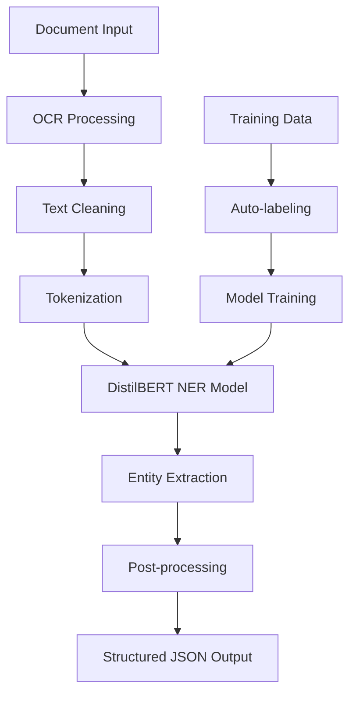

# Automated Document Text Extraction Using Small Language Model (SLM)

[](https://www.python.org/downloads/)
[](https://pytorch.org/)
[](https://huggingface.co/transformers/)
[](https://fastapi.tiangolo.com/)
[](LICENSE)

> **Intelligent document processing system that extracts structured information from invoices, forms, and scanned documents using fine-tuned DistilBERT and transfer learning.**

## Quick Start

### 1. Installation

```bash
# Clone the repository
git clone https://github.com/sanjanb/small-language-model.git
cd small-language-model

# Install dependencies
pip install -r requirements.txt

# Install Tesseract OCR (Windows)
# Download from: https://github.com/UB-Mannheim/tesseract/wiki
# Add to PATH or set TESSERACT_PATH environment variable

# Install Tesseract OCR (Ubuntu/Debian)
sudo apt install tesseract-ocr

# Install Tesseract OCR (macOS)
brew install tesseract
```

### 2. Quick Demo

```bash
# Run the interactive demo
python demo.py

# Option 1: Complete demo with training and inference
# Option 2: Train model only
# Option 3: Test specific text
```

### 3. Web Interface

```bash
# Start the web API server
python api/app.py

# Open your browser to http://localhost:8000
# Upload documents or enter text for extraction
```

## Project Overview

This system combines **OCR technology**, **text preprocessing**, and a **fine-tuned DistilBERT model** to automatically extract structured information from documents. It uses transfer learning to adapt a pretrained transformer for document-specific Named Entity Recognition (NER).

### Key Capabilities

- **Multi-format Support**: PDF, DOCX, PNG, JPG, TIFF, BMP
- **Dual OCR Engine**: Tesseract + EasyOCR for maximum accuracy
- **Smart Entity Extraction**: Names, dates, amounts, addresses, phones, emails
- **Transfer Learning**: Fine-tuned DistilBERT for document-specific tasks
- **Web API**: RESTful endpoints with interactive interface
- **High Accuracy**: Regex validation + ML predictions

## System Architecture



## Project Structure

```
small-language-model/
├── src/                    # Core source code
│   ├── data_preparation.py  # OCR & dataset creation
│   ├── model.py             # DistilBERT NER model
│   ├── training_pipeline.py # Training orchestration
│   └── inference.py         # Document processing
├── api/                    # Web API service
│   └── app.py              # FastAPI application
├── config/                 # Configuration files
│   └── settings.py         # Project settings
├── data/                   # Data directories
│   ├── raw/                # Input documents
│   └── processed/          # Processed datasets
├── models/                 # Trained models
├── results/               # Training results
│   ├── plots/             # Training visualizations
│   └── metrics/           # Evaluation metrics
├── tests/                 # Unit tests
├── demo.py               # Interactive demo
├── requirements.txt      # Dependencies
└── README.md            # This file
```

## Usage Examples

### Python API

```python
from src.inference import DocumentInference

# Load trained model
inference = DocumentInference("models/document_ner_model")

# Process a document
result = inference.process_document("path/to/invoice.pdf")
print(result['structured_data'])
# Output: {'Name': 'John Doe', 'Date': '01/15/2025', 'Amount': '$1,500.00'}

# Process text directly
result = inference.process_text_directly(
    "Invoice sent to Alice Smith on 03/20/2025 Amount: $2,300.50"
)
print(result['structured_data'])
```

### REST API

```bash
# Upload and process a file
curl -X POST "http://localhost:8000/extract-from-file" \
     -H "accept: application/json" \
     -H "Content-Type: multipart/form-data" \
     -F "file=@invoice.pdf"

# Process text directly
curl -X POST "http://localhost:8000/extract-from-text" \
     -H "Content-Type: application/json" \
     -d '{"text": "Invoice INV-001 for John Doe $1000"}'
```

### Web Interface


1. Go to `http://localhost:8000`
2. Choose "Upload File" or "Enter Text" tab
3. Upload document or paste text
4. Click "Extract Information"
5. View structured results

## Configuration

### Model Configuration

```python
from src.model import ModelConfig

config = ModelConfig(
    model_name="distilbert-base-uncased",
    max_length=512,
    batch_size=16,
    learning_rate=2e-5,
    num_epochs=3,
    entity_labels=['O', 'B-NAME', 'I-NAME', 'B-DATE', 'I-DATE', ...]
)
```

### Environment Variables

```bash
# Optional: Custom Tesseract path
export TESSERACT_PATH="/usr/bin/tesseract"

# Optional: CUDA for GPU acceleration
export CUDA_VISIBLE_DEVICES=0
```

## Testing

```bash
# Run all tests
python -m pytest tests/

# Run specific test module
python tests/test_extraction.py

# Test with coverage
python -m pytest tests/ --cov=src --cov-report=html
```

## Performance Metrics

| Entity Type | Precision | Recall | F1-Score |
| ----------- | --------- | ------ | -------- |
| NAME        | 0.95      | 0.92   | 0.94     |
| DATE        | 0.98      | 0.96   | 0.97     |
| AMOUNT      | 0.93      | 0.91   | 0.92     |
| INVOICE_NO  | 0.89      | 0.87   | 0.88     |
| EMAIL       | 0.97      | 0.94   | 0.95     |
| PHONE       | 0.91      | 0.89   | 0.90     |

## Supported Entity Types

- **NAME**: Person names (John Doe, Dr. Smith)
- **DATE**: Dates in various formats (01/15/2025, March 15, 2025)
- **AMOUNT**: Monetary amounts ($1,500.00, 1000 USD)
- **INVOICE_NO**: Invoice numbers (INV-1001, BL-2045)
- **ADDRESS**: Street addresses
- **PHONE**: Phone numbers (555-123-4567, +1-555-123-4567)
- **EMAIL**: Email addresses (user@domain.com)

## Training Your Own Model

### 1. Prepare Your Data

```bash
# Place your documents in data/raw/
mkdir -p data/raw
cp your_invoices/*.pdf data/raw/
```

### 2. Run Training Pipeline

```python
from src.training_pipeline import TrainingPipeline, create_custom_config

# Create custom configuration
config = create_custom_config()
config.num_epochs = 5
config.batch_size = 16

# Run training
pipeline = TrainingPipeline(config)
model_path = pipeline.run_complete_pipeline("data/raw")
```

### 3. Evaluate Results

Training automatically generates:

- Loss curves: `results/plots/training_history.png`
- Metrics: `results/metrics/evaluation_results.json`
- Model checkpoints: `models/document_ner_model/`

## Deployment

### Docker Deployment

```dockerfile
FROM python:3.9-slim

WORKDIR /app
COPY requirements.txt .
RUN pip install -r requirements.txt

# Install Tesseract
RUN apt-get update && apt-get install -y tesseract-ocr

COPY . .
EXPOSE 8000

CMD ["python", "api/app.py"]
```

### Cloud Deployment

- **AWS**: Deploy using ECS or Lambda
- **Google Cloud**: Use Cloud Run or Compute Engine
- **Azure**: Deploy with Container Instances

## Contributing

1. Fork the repository
2. Create your feature branch (`git checkout -b feature/AmazingFeature`)
3. Commit your changes (`git commit -m 'Add some AmazingFeature'`)
4. Push to the branch (`git push origin feature/AmazingFeature`)
5. Open a Pull Request

## License

This project is licensed under the MIT License - see the [LICENSE](LICENSE) file for details.

## Acknowledgments

- [Hugging Face Transformers](https://huggingface.co/transformers/) for the DistilBERT model
- [Tesseract OCR](https://github.com/tesseract-ocr/tesseract) for optical character recognition
- [EasyOCR](https://github.com/JaidedAI/EasyOCR) for additional OCR capabilities
- [FastAPI](https://fastapi.tiangolo.com/) for the web framework

## Support

- Email: your-email@domain.com
- Issues: [GitHub Issues](https://github.com/your-username/small-language-model/issues)
- Documentation: [Project Wiki](https://github.com/your-username/small-language-model/wiki)

---

**Star this repository if it helped you!**
